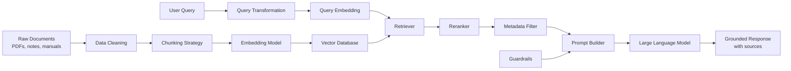
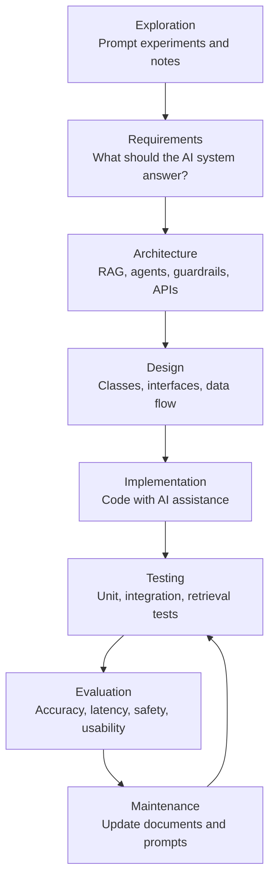
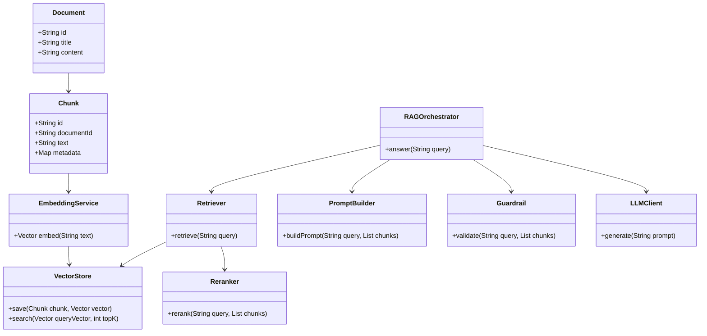

# From Exploration to Engineering: Designing AI-Supported Software with LLMs, RAG, and Agentic Workflows

## Scope

This chapter lays the conceptual foundation for the entire book. It covers three big ideas:

1. **How LLMs work** — next-token prediction, the Transformer architecture, and why hallucination happens.
2. **The separation of compute and context** — why grounding responses in external knowledge is the key engineering discipline.
3. **From exploration to engineering** — how informal prompt experiments become formal software systems with testable, maintainable behaviour.

This chapter does not go deep on RAG implementation (that's Chapter 3), agentic orchestration (that's Chapter 2), or production deployment (that's Chapter 5). It establishes the mental models those chapters build on.

---

## Learning Objectives

By the end of this chapter, students should be able to:

- Explain how Large Language Models generate responses through next-token prediction and why this creates both powerful capabilities and factual risks.
- Describe how Retrieval-Augmented Generation separates model computation from external knowledge.
- Translate exploratory AI experimentation into formal software engineering workflows, including requirements analysis, architecture, implementation, testing, and evaluation.
- Use AI development tools responsibly to generate, critique, and improve object-oriented software designs.

---

## Theoretical Foundation

Modern AI-supported software development begins with a simple but important idea: an LLM is not a database, a search engine, or a permanently updated knowledge system. At its core, an LLM predicts the next token based on previous context. This principle explains why LLMs can produce coherent text, code, summaries, and design suggestions, while also explaining why their outputs must be checked carefully.

The Transformer architecture enables this behaviour through mechanisms such as self-attention, which allow the model to consider relationships between words and phrases across a longer context. However, this does not mean that the model truly “knows” facts in the same way a database stores records. It generates likely continuations based on patterns learned during training.

This distinction is essential in software engineering. A model may produce fluent and confident text even when it is wrong. This problem is often called **hallucination**, where the model generates false, fabricated, or unsupported information. Hallucination is especially likely when the user asks about information outside the model’s training data, after its knowledge cut-off, or beyond the context provided in the prompt.

A key engineering principle is therefore the **separation of compute and context**.

- **Compute** refers to the foundation model: the LLM that performs language understanding, reasoning support, and response generation.
- **Context** refers to the specific information supplied at runtime: documents, database records, APIs, course notes, policies, or source code.

This separation leads directly to **Retrieval-Augmented Generation**, or **RAG**. Instead of retraining the model whenever knowledge changes, a RAG system retrieves relevant information from an external knowledge base and inserts that information into the prompt. The model then generates an answer grounded in the retrieved context.

In a professional software system, this means that knowledge can be updated independently of the model. A company policy document, course handbook, or programming guide can be changed, re-indexed, and made available to the AI system without requiring the LLM itself to be retrained.

RAG normally includes two major workflows:

1. **Ingestion and indexing**: documents are cleaned, divided into chunks, converted into embeddings, and stored in a vector database.
2. **Retrieval and generation**: the user query is embedded, relevant chunks are retrieved, the best results are selected or reranked, and the LLM generates an answer using the retrieved context.

The notes also identify several advanced strategies that make AI systems more reliable:

- **Chunking strategies** divide large documents into smaller, retrievable units.
- **Embedding models** convert text into numerical vectors that represent meaning.
- **Vector databases** store and search these vectors efficiently.
- **Rerankers** reorder retrieved results so the most useful material appears first.
- **Metadata filtering** narrows retrieval by document type, topic, date, source, or user role.
- **Guardrails** prevent unsupported, unsafe, or irrelevant responses.
- **Agentic workflows** coordinate multiple reasoning steps or specialised agents.

Agentic design patterns include single-agent systems, sequential agents, parallel agents, review-and-critique agents, routing agents, and agent-as-a-tool designs. These patterns become useful when the application requires more than simple question answering. For example, one agent may retrieve documentation, another may generate code, and another may critique the solution before it is accepted.

---

## Architecture & Workflow

A common beginner approach is to experiment directly with prompts: ask the AI a question, copy the answer, test it, revise the prompt, and continue. This is a valid learning path. In professional software engineering, however, that exploration must be converted into a controlled lifecycle.

| Exploratory activity | Engineering interpretation |
|---|---|
| “Ask the AI to explain RAG” | Requirements discovery and concept clarification |
| “Try chunking documents” | Data preprocessing and information architecture |
| “Use embeddings” | Semantic indexing and retrieval design |
| “Add reranker and metadata” | Retrieval optimisation and relevance control |
| “Add guardrails” | Safety, validation, and quality assurance |
| “Use review and critique agents” | Automated design review and verification support |

The architecture below shows a formal RAG-based AI application. The system keeps the foundation model separate from the knowledge base. This improves maintainability because documents can be updated independently of the model.



The same process can also be understood as a software development lifecycle.



This shift from “hacker mode” to engineering practice does not reject experimentation. It disciplines it. Exploration helps discover possibilities. Engineering turns those possibilities into systems that can be tested, maintained, and trusted.

---

## Practical Application

### Scenario: Build a Course FAQ Assistant

Assume you are building an AI assistant for a programming course. Students can ask questions such as:

> “What is the difference between a `for` loop and a `while` loop?”

The assistant should answer using approved course material rather than guessing. This is an ideal RAG use case.

The scenario follows five distinct steps:

1. **Accept question** — the student submits a question via a chat interface.
2. **Retrieve** — the system embeds the question, searches the vector database for relevant lecture notes or Q&A entries, and returns the top matching chunks.
3. **Generate** — the LLM produces an answer grounded in the retrieved context (not in its training data).
4. **Cite sources** — the response includes references to the specific documents or sections used.
5. **Follow up** — the assistant suggests a clarifying question to check whether the student's understanding is correct.

Each step maps to a component in the class diagram: `Retriever` handles step 2, `PromptBuilder` handles steps 3-4, `Guardrail` handles step 5, and `RAGOrchestrator` coordinates the full sequence.

### Step 1: Define the Requirements

Before writing code, define what the assistant must and must not do.

Functional requirements:

- Accept a student question.
- Retrieve relevant course material.
- Generate an answer based on retrieved content.
- Provide a reference to the source material.
- Ask a follow-up question to check understanding.

Non-functional requirements:

- Avoid unsupported answers.
- Keep latency acceptable.
- Protect private course data.
- Allow course documents to be updated without retraining the model.

### Step 2: Design the Core Object-Oriented Components

A clean object-oriented design separates responsibilities.

```text
Document
 └── represents the original uploaded file

Chunk
 └── represents a smaller section of a document

EmbeddingService
 └── converts text into numerical vectors

VectorStore
 └── stores and searches embeddings

Retriever
 └── finds candidate chunks for a query

Reranker
 └── orders retrieved chunks by relevance

PromptBuilder
 └── combines user query, retrieved context, and instructions

Guardrail
 └── checks whether the system should answer, refuse, or ask for clarification

LLMClient
 └── sends the final prompt to the language model

RAGOrchestrator
 └── coordinates the full workflow
```

A simplified class relationship can be shown as follows:



### Step 3: Use AI Assistance as a Pair Programmer

AI tools are useful, but they should not replace engineering judgement. A good workflow is:

1. Ask the AI to propose an initial design.
2. Ask it to critique the design.
3. Ask it to identify missing edge cases.
4. Ask it to generate small units of code.
5. Test and revise the output manually.

Example prompt for design generation:

```text
You are acting as a senior software engineer.
Design an object-oriented architecture for a RAG-based course FAQ assistant.

Constraints:
- Separate retrieval, prompt construction, guardrails, and LLM access.
- Use interfaces where external services may change.
- The system must support document updates without retraining the model.
- Provide class responsibilities, not full implementation code.
```

Example prompt for critique:

```text
Review the following object-oriented design for a RAG-based assistant.

Focus on:
1. Single Responsibility Principle
2. Dependency inversion
3. Testability
4. Failure cases
5. Security and hallucination risks

Do not rewrite the whole design. Identify weaknesses and propose precise improvements.
```

Example prompt for testing:

```text
Generate unit test scenarios for the Retriever, PromptBuilder, and Guardrail components.

Include:
- Normal cases
- Empty retrieval results
- Irrelevant retrieved chunks
- Ambiguous student questions
- Attempts to ask for unsupported information
```

### Step 4: Apply Guardrails

A responsible AI-supported system should not answer every question. For example, if the student asks about a topic outside the course documents, the assistant should say that it cannot answer from the available material.

A guardrail rule might be:

```text
If no retrieved chunk has sufficient relevance, do not generate a direct answer.
Instead, ask the student to clarify or state that the available course material does not contain enough information.
```

This is the difference between a chatbot that sounds confident and a software system designed for academic reliability.

### Step 5: Extend with Agentic Patterns

Once the basic RAG pipeline works, agentic design patterns can improve the workflow.

| Pattern | Use in this project |
|---|---|
| Single agent | One assistant retrieves and answers. |
| Sequential agents | One agent retrieves, another explains, another checks accuracy. |
| Parallel agents | Multiple agents search different sources at the same time. |
| Review and critique | A reviewer agent checks whether the answer is supported by retrieved evidence. |
| Routing agent | The system decides whether to answer from course notes, programming documentation, or ask for clarification. |
| Agent-as-a-tool | A specialist agent, such as a code reviewer, is called only when needed. |

For beginners, start with a single-agent RAG pipeline. Add agentic patterns only when there is a clear engineering reason. More agents can improve quality, but they also increase complexity, cost, and testing effort.

---

## Review & Discussion

1. Why is it risky to treat an LLM as a source of factual knowledge rather than as a language model that generates probable text?

2. In a RAG system, what could go wrong if the chunking strategy is poorly designed, even if the LLM itself is powerful?

3. When using AI-assisted coding tools, how can students distinguish between productive assistance and over-reliance on generated code?

---

## Coding Lab

**Lab: Build a Minimal RAG Pipeline**

In this lab you will build the smallest possible RAG system that demonstrates the full ingestion-to-generation flow.

**Setup**

Create a new project directory. You will need:
- Python 3.10+
- An OpenAI API key (or compatible: Anthropic, Gemini, local Ollama)
- `chromadb` (vector store) and `openai` (SDK)

```bash
pip install chromadb openai python-dotenv
```

Create a `.env` file:

```
OPENAI_API_KEY=your_key_here
```

**Part 1 — Ingestion**

Create a file `ingest.py`. Add 5 text chunks about a programming topic you know well (e.g., loops, functions, classes). Each chunk should be 1-3 sentences. Use a simple list of Python dictionaries:

```python
docs = [
    {"id": "1", "text": "A for loop iterates over a sequence in order, executing the body once per element."},
    {"id": "2", "text": "A while loop repeats as long as its condition remains true, checking before each iteration."},
    {"id": "3", "text": "Both for and while loops can be terminated early with the break statement."},
    {"id": "4", "text": "The range() function generates a sequence of integers for use in for loops."},
    {"id": "5", "text": "Nested loops are loops inside loops; the inner loop completes all iterations for each iteration of the outer loop."},
]
```

Write code to:
1. Embed each chunk using `text-embedding-ada-002` (or your provider's default embedding model).
2. Store embeddings in ChromaDB with the chunk ID as the key.

**Part 2 — Retrieval**

Create a file `retrieve.py`. Write a function `retrieve_chunks(query, top_k)` that:
1. Embeds the query using the same embedding model.
2. Queries ChromaDB for the top `top_k` results.
3. Returns the text of the retrieved chunks (not the vectors).

Test it with: `"What is a for loop?"`

Print the retrieved chunks. How many did you get? Do they relate to the query?

**Part 3 — Generation**

Create a file `generate.py`. Write a function `answer(query, retrieved_chunks)` that:
1. Builds a prompt containing the retrieved chunks and the user's question.
2. Calls the LLM with the prompt.
3. Returns the response and prints it with the sources listed below it.

Prompt template:

```
You are a course assistant. Use the following context to answer the question.

Context:
{retrieved_chunks}

Question: {query}
```

**Part 4 — Run the Full Pipeline**

Create a file `rag.py` that chains Parts 1-3 together:

```python
query = input("Ask a question about programming: ")
chunks = retrieve_chunks(query, top_k=3)
response = answer(query, chunks)
print(response)
```

Run it and ask: "What is the difference between a for loop and a while loop?"

**Reflection Questions**

- Did the model answer correctly? Where did it get its information?
- What would happen if none of the retrieved chunks were relevant to the query?
- How would you detect if the model was answering from its training data rather than the retrieved context?
- What would you change about the chunk size, the number of chunks, or the prompt if the answer was wrong?

**Extension (if time allows)**

Add a relevance threshold: if the cosine similarity of the top retrieved chunk is below a threshold you define (e.g., 0.7), return a message saying "I don't have enough information in the course materials to answer that question." This is the guardrail pattern applied to the retrieval step.

This chapter was synthesised from the following uploaded notes:

- `What is the first LLM principle.docx`: next-token prediction, Transformer architecture, and separation of compute and context.
- `ChunkingStrategiesinRAG.docx`: RAG limitations, hallucination, ingestion, chunking, embeddings, vector databases, retrieval, reranking, metadata, guardrails, and RAG strengths and limitations.
- `What is Agentic Design Patten.docx`: single-agent, sequential, parallel, review-and-critique, routing-agent, and agent-as-a-tool design patterns.
