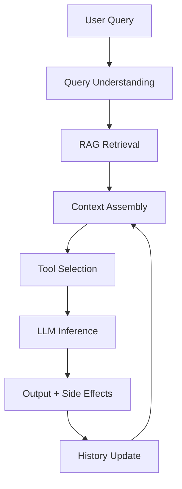
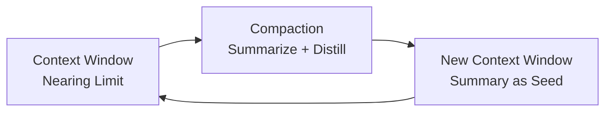

# From Exploration to Engineering: Context Engineering

## Scope

Context engineering is the discipline that makes everything else in this book work. Every AI-supported application — every RAG pipeline, every agentic workflow, every LLM integration — succeeds or fails based on what context the model has when it generates a response. This chapter teaches you to treat context as infrastructure: something you design, measure, and optimize deliberately.

This chapter does not stand alone. It connects every chapter that came before it:
- **Ch1** (prompting) showed you how to write instructions. Context engineering shows you what to put *around* those instructions.
- **Ch2** (agentic workflows) showed you how agents act. Context engineering shows you how to keep agents from losing the thread.
- **Ch3+** (RAG and integrations) showed you how to retrieve documents. Context engineering shows you how to retrieve *the right documents at the right time*.

By the end of this chapter, you will understand context engineering as a systems discipline — not a single prompt, but a context pipeline that runs every time an LLM generates a response.

---

## Learning Objectives

By the end of this chapter, students should be able to:

- Explain the difference between prompt engineering and context engineering, and why both matter.
- Describe the three failure modes of context: too little, too much, and the wrong kind.
- Apply context pruning, compaction, and structured note-taking to keep agent context windows focused.
- Design a context pipeline that selects, sequences, and refreshes information across multi-turn interactions.
- Implement token-efficient tools that return only what the agent needs — not everything available.
- Use just-in-time retrieval instead of loading all context up front, and know when to use each.
- Build a short-term memory layer (rolling conversation summary) and a long-term memory layer (persistent user preferences and session history).
- Evaluate context quality with an explicit eval pipeline — not just "it looks okay."

---

## Theoretical Foundation

### Prompt Engineering vs. Context Engineering

The distinction matters because the failure modes are different.

**Prompt engineering** asks: *"How should I phrase this?"* It focuses on words, structure, and linguistic precision within a single interaction. It works well for one-off queries. It takes the context window as given.

**Context engineering** asks: *"What information does the model need access to right now?"* It focuses on information selection, sequencing, and delivery across the entire system. It thinks in sequences — what did previous turns establish? What tool outputs carry forward? What should persist three steps from now?

As tasks move from simple question-answering to multi-step agent workflows, context engineering becomes the dominant challenge. A perfect prompt with the wrong context produces a wrong answer.

### The Three Context Failure Modes

LLMs are stateless functions. At any given moment, your input is: *"Here's what's happened so far. What's the next step?"* Context engineering manages a finite resource — the context window — with three distinct failure modes:

**1. Too little context — hallucination and bad responses**
When the LLM lacks enough information, it cannot determine the semantic context to generate accurate responses. It fills the gap with plausible-sounding fabrications. This is the most dangerous failure mode because the output *looks* confident.

**2. Too much context — overflow and dilution**
Context windows are finite. Feed too much information and the model's attention diffuses — it struggles to identify which parts matter most. Performance drops on exactly the queries where precision matters most. Cost also rises.

**3. Distracting or conflicting context — confusion**
When the context includes information that contradicts or is irrelevant to the current task, the model gets pulled off-topic. Larger context windows increase the probability of this happening. A retrieval system that returns 10 results when 2 are relevant introduces 8 distractors.

### The Right Altitude

Anthropic's concept of **altitude** describes where your instructions sit on the spectrum from vague to over-specified:

- **Too high (vague):** "Be helpful." The model has no concrete signals for desired outputs and falsely assumes shared context that doesn't exist.
- **Too low (brittle):** Hardcoded logic that anticipates every scenario. Creates fragility and maintenance complexity over time.
- **The right altitude:** Specific enough to guide behavior effectively, yet flexible enough to let the model apply good judgment.

The goal is the minimal set of information that fully outlines expected behavior — not the shortest possible prompt, but the most focused one.

### Context as Infrastructure

Context is not a prompt. It's the output of a system that runs *before* the main LLM call. That system includes:

- System instructions (role, constraints, output format)
- Tool definitions (what the agent can do)
- External knowledge (retrieved documents, RAG grounding)
- Conversation history (short-term memory)
- Stateful information (user preferences, session data)
- Just-in-time context (discovered or computed during the turn)

Once you see context this way, you stop asking "how do I write a better prompt?" and start asking "how do I build a better context pipeline?"

---

## Architecture

### The Context Pipeline

Every LLM inference runs through the same pipeline:



**Context Assembly** is where context engineering happens. It's not just concatenating everything — it's selecting, ordering, and compressing. The context that arrives at the LLM should be the smallest set of high-signal tokens that maximizes the probability of the desired outcome.

### Context Types Across Time

**Single-turn context** (one query, one response):
- System prompt
- User query with formatting
- Retrieved knowledge (RAG)
- Few-shot examples

**Multi-turn context** (conversation spanning multiple exchanges):
- Rolling conversation summary (compaction)
- Structured notes written by the agent (agentic memory)
- Cumulative tool outputs

**Long-horizon context** (tasks that run for minutes to hours):
- All of the above, plus:
- Periodic compaction (summarize and restart context window)
- Just-in-time context injection (discover and load as needed)
- Multi-agent context partitioning (different agents, different contexts)

### The Compaction Cycle

For long-horizon tasks, context windows fill up. The solution is **compaction** — periodically summarizing the current context, then restarting with a distilled version:



The art of compaction is selection: what to keep versus what to discard. Overly aggressive compaction loses subtle but critical context. Overly conservative compaction lets noise accumulate.

Tuning compaction requires looking at actual agent traces. Start by maximizing recall — capture everything relevant. Then iterate to improve precision by eliminating superfluous content.

### Structured Note-Taking (Agentic Memory)

Agents can write notes to external storage and pull them back in at later steps. This is **agentic memory** — a form of context offloading that lets the context window stay focused.

Example patterns:
- Agent writes intermediate findings to a JSON file, reads them back at next step
- Agent maintains a "task state" object updated after each tool call
- Agent writes a "scratchpad" of reasoning that gets summarized before compaction

The key principle: **write for future retrieval**. Notes should include the question they answer, not just the answer. "User asked about refund policy" is better than "Refund policy is 30 days."

### Tool Context Efficiency

Tools define the contract between agent and environment. A poorly designed tool returns too much or too little:

- **Token-efficient tools** return only what the next step needs
- **Ambiguous tools** (overlapping functionality) cause agents to make wrong tool choices
- **Dense tools** (returning raw database dumps) force the agent to filter

The principle: *Curate the minimal viable set of tools.* Each tool should be self-contained, unambiguous in purpose, and robust to error.

---

## Practical Application

### Scenario: Deep Research Agent

You are building an agent that conducts deep research on a topic. It needs to:
1. Search the web for relevant sources
2. Read and extract key information from top results
3. Synthesize findings into a report
4. Cite sources with links

This task runs for potentially dozens of steps. A naive implementation loads all retrieved content into context and eventually overflows. The context-engineered version stays focused.

### Step 1: Design the Context Pipeline

Before writing any code, define the context architecture:

```
Context Components:
├── System prompt (role: research assistant, constraints: cite sources)
├── User query (the research question)
├── Rolling summary (last 5 exchanges, compressed)
├── Current task state (what we've found so far, what's left)
├── Relevant retrieved content (top 3 results, not all results)
└── Tool output from last step (only if needed for next step)
```

### Step 2: Implement Compaction

Every N turns (where N is tuned empirically), trigger compaction:

```python
def compact_context(messages: list[dict], summary_model) -> str:
    """
    Summarize the conversation into a focused context seed.
    Preserves: key facts, user preferences, open questions, current direction.
    Discards: failed experiments, verbose reasoning traces, redundant tool outputs.
    """
    recent = messages[-20:]  # last 20 exchanges
    summary_prompt = f"""Summarize this research conversation.
    Keep: key findings, source citations, open questions, user's stated preferences.
    Discard: verbose reasoning, failed search queries, redundant tool outputs.
    Format: third-person narrative suitable as context for a continuation.

    Conversation:
    {format_messages(recent)}
    """
    return summary_model.invoke(summary_prompt)
```

### Step 3: Implement Just-In-Time Retrieval

Instead of pre-loading all retrieved content:

```python
def retrieve_for_step(query: str, retrieved_results: list[dict]) -> list[dict]:
    """
    From already-retrieved results, select only what's relevant to current step.
    Re-ranking is cheap; context overflow is expensive.
    """
    if not retrieved_results:
        return []

    # Semantic re-ranking using the current query as query vector
    reranked = semantic_rerank(query=query, documents=retrieved_results, top_k=3)
    return reranked
```

### Step 4: Build Token-Efficient Tools

A web search tool should return summaries, not raw HTML:

```python
def search_web(query: str) -> list[dict]:
    """
    Returns token-efficient results: title, URL, 2-sentence summary.
    Does NOT return raw HTML or full page content.
    """
    results = web_search(query, top_k=10)
    return [
        {
            "title": r.title,
            "url": r.url,
            "summary": r.summary[:200],  # truncate to ~200 chars
            "relevance_score": r.score
        }
        for r in results
    ]
```

### Step 5: Add a Memory Layer

Both short-term and long-term memory:

```python
class Memory:
    short_term: list[dict]    # rolling window of recent exchanges
    long_term: dict            # persistent: user preferences, session history

    def add(self, message: dict):
        self.short_term.append(message)
        if len(self.short_term) > 20:
            self.compact()

    def compact(self):
        summary = summarize(self.short_term)
        self.long_term["last_summary"] = summary
        self.short_term = []

    def get_context(self) -> str:
        parts = []
        if "last_summary" in self.long_term:
            parts.append(f"Prior context: {self.long_term['last_summary']}")
        parts.append(f"Recent: {format_messages(self.short_term[-5:])}")
        return "\n\n".join(parts)
```

---

## Review & Discussion

1. A context window has a 128,000-token limit and your agent is getting slow responses. Name three possible causes and how you would diagnose which one it is.

2. You are designing a customer support agent that must access both the user's account history and a product knowledge base. What context engineering decisions would you make to prevent the agent from confusing which account it's talking about?

3. Compaction is described as an art of selection. What information would you *never* discard during compaction, even if it seems redundant?

---

## Coding Lab

**Lab: Build a Context-Aware Research Agent**

In this lab you will build a research agent that maintains context across a multi-step investigation, using compaction and just-in-time retrieval to stay within a realistic context window.

**Setup**

```bash
pip install anthropic python-dotenv faiss-cpu tiktoken
```

Create a `.env` file:
```
ANTHROPIC_API_KEY=your_key_here
```

**Part 1 — The Context Pipeline**

Create a file `context_pipeline.py`. Implement:

1. A `ResearchContext` class that holds: system prompt, rolling summary, current task state, retrieved results, tool outputs from last step.
2. A `compact()` method that summarizes the rolling context when it exceeds a token limit (use `tiktoken` to count tokens).
3. A `get_context_window()` method that assembles the current context for the LLM call, selecting only the top-k most relevant retrieved results.

**Part 2 — Token-Efficient Search Tool**

Create a file `research_tools.py`. Implement:

1. A `search_web()` tool that returns `{title, url, summary, score}` — not raw HTML.
2. A `read_page()` tool that extracts the most relevant paragraphs from a URL.
3. A `rerank_results()` function that takes a query and a list of search results, returning the top 3 most semantically relevant.

**Part 3 — The Research Agent**

Create a file `research_agent.py`. Implement:

1. An agent that takes a research question and conducts a multi-step investigation.
2. After each tool call, the agent decides: should I continue, am I done, or do I need to compact?
3. Implement compaction that triggers after every 5 tool calls.
4. After each compaction, the agent prints a one-sentence progress update.

**Part 4 — Eval**

Create a file `eval_context.py`. Measure:

1. Token count before and after compaction. Report the compression ratio.
2. Whether the compacted context still contains key facts from earlier steps.
3. Whether the agent's final answer cites sources found in the first retrieval step (traceability test).

**Reflection Questions**

- What was the compression ratio after compaction? Was any critical context lost?
- How did you decide when to trigger compaction — fixed token limit, or something else?
- What would change if this agent ran for 100 steps instead of 20?

---

*Context engineering is the discipline that turns "it sometimes works" into "it reliably works." The context pipeline is the difference between an AI application that gets lucky and one that you can bet a production system on.*
