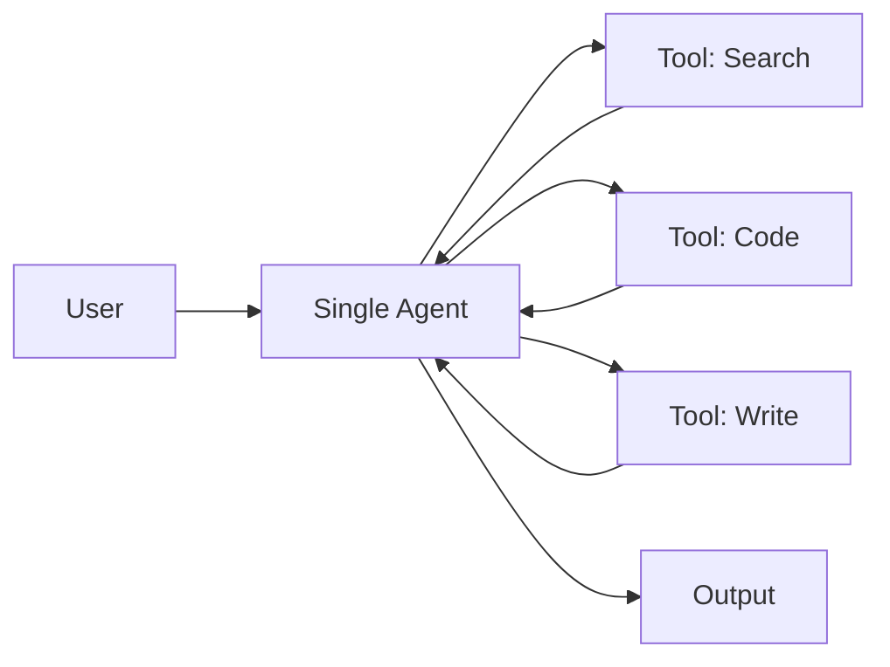
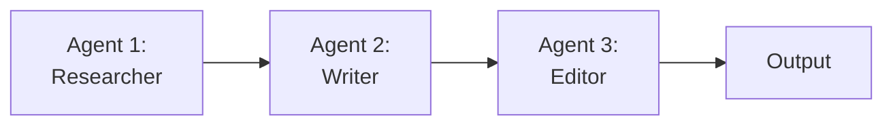
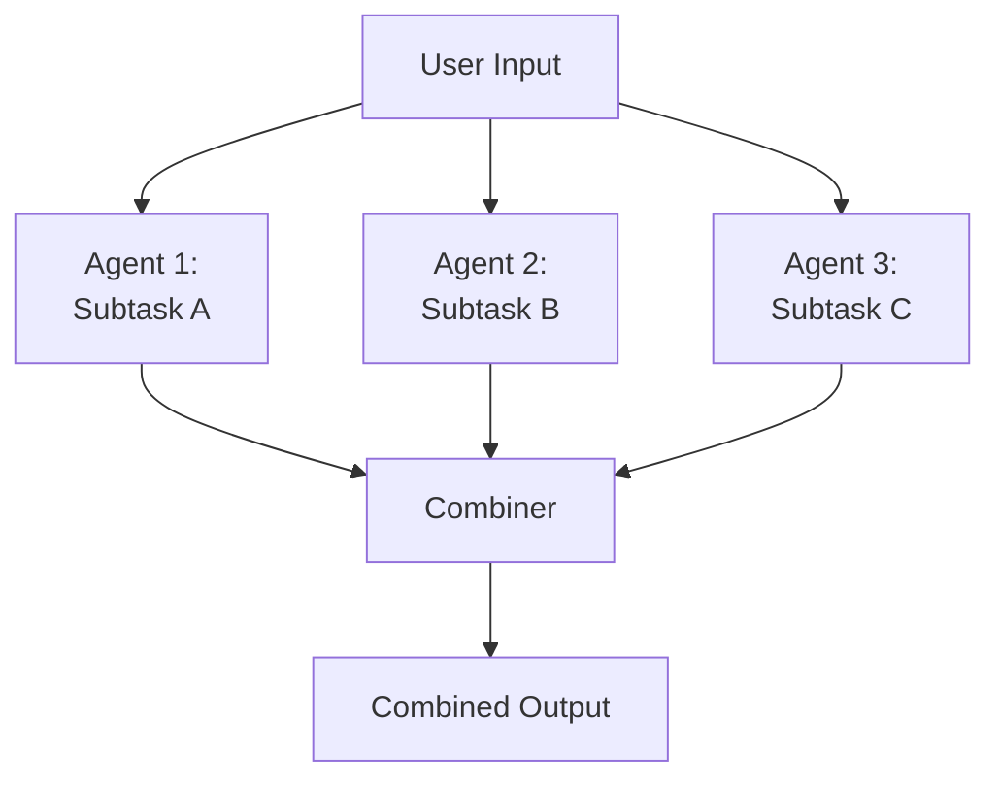
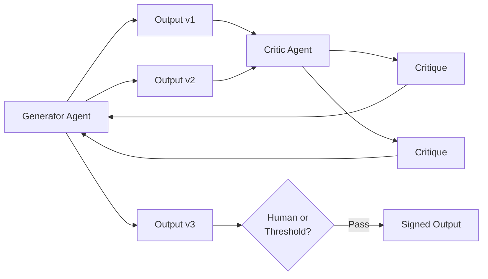
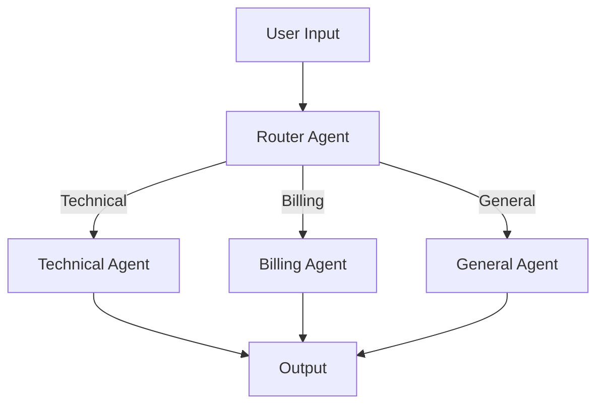
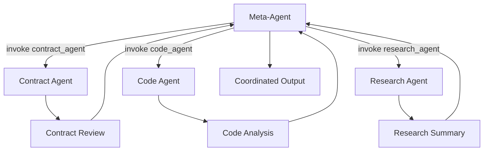

# Agentic Design Patterns

## Scope

An agentic system is only as good as its design pattern. The difference between a useful AI application and a brittle one often comes down to how many agents you use, how they communicate, and when they hand off control. This chapter is a practical catalog of six agentic design patterns — three foundational and three advanced.

Use this chapter as a reference: when you face a design decision, read the relevant pattern and apply it. You do not need to read it in order.

---

## Learning Objectives

By the end of this chapter, you should be able to:

- Identify which of the six patterns fits a given problem.
- Explain the tradeoffs of each pattern — when it scales and when it breaks.
- Implement each pattern in code using a common agent framework.
- Combine patterns: most production systems use two or three together.
- Know when NOT to use a multi-agent design — sometimes a single agent with good prompting is the right answer.

---

## The Patterns

### Basic Patterns

#### 1. Single Agent

**What it is:** One agent handles a complete task from start to finish. It has a system prompt, a set of tools, and handles all decisions internally.

**When to use it:**
- Straightforward tasks with a clear path from input to output
- Tasks where the agent can self-correct using its own reasoning
- When latency and cost are concerns — no agent-to-agent communication overhead
- Prototyping before adding complexity

**When NOT to use it:**
- Tasks requiring different expertise domains — don't make one agent try to be a lawyer AND an engineer
- Tasks where you need a human checkpoint before a consequential action
- Tasks that are getting too long or too complex for one agent to track

**Tradeoffs:**

| Pros | Cons |
|------|------|
| Simple to build and debug | Struggles with tasks requiring different knowledge domains |
| Low latency — no coordination overhead | One agent's context window fills up on long tasks |
| Easy to add tools and test | Hard to audit — all decisions trace through one agent |

**Architecture:**



**Code example (LangChain style):**

```python
from langchain.chat_models import ChatAnthropic

@tool
def search_web(query: str) -> str:
    """Search the web for relevant information."""
    return results

@tool
def write_report(topic: str, findings: str) -> str:
    """Write a formatted report on the topic."""
    return report

model = ChatAnthropic(model="claude-sonnet-4-20250514")
agent = Agent(
    model=model,
    tools=[search_web, write_report],
    system_prompt="You are a research assistant. "
        "Search for information, then write a concise report."
)
result = agent.run("Research the history of the Silk Road")
```

---

#### 2. Sequential Agents

**What it is:** A pipeline of agents where each agent completes its step and passes output to the next agent. Agent 1 produces X, which becomes the input to Agent 2, which produces Y, and so on.

**When to use it:**
- Tasks with distinct phases that must happen in order (research → write → edit → publish)
- When each phase requires different tools or knowledge
- When you need to audit each step's output before the next begins
- When one agent's output naturally sets up the next agent's input

**When NOT to use it:**
- When steps could run in parallel — sequential forces waiting
- When a downstream agent needs to send feedback to an upstream agent (requires looping, not sequencing)
- When the handoff between agents is lossy — too much context drops at each boundary

**Tradeoffs:**

| Pros | Cons |
|------|------|
| Clear phase boundaries — easy to test each step | If one step fails, the whole pipeline stalls |
| Each agent can specialize in its phase | Sequential latency adds up: time = sum of all agent times |
| Easy to insert a human checkpoint between steps | Context loss at each handoff |

**Architecture:**



**Code example:**

```python
class SequentialPipeline:
    def __init__(self, agents: list[Agent]):
        self.agents = agents

    def run(self, input: str) -> str:
        context = input
        for agent in self.agents:
            result = agent.run(context)
            context = result  # pass output to next agent
        return context

researcher = Agent(model=model, tools=[search], system_prompt="Research the topic thoroughly.")
writer = Agent(model=model, tools=[write], system_prompt="Write a first draft from the research findings.")
editor = Agent(model=model, tools=[edit], system_prompt="Edit and polish the draft.")

pipeline = SequentialPipeline([researcher, writer, editor])
final_output = pipeline.run("The impact of LLMs on software development")
```

---

#### 3. Parallel Agents

**What it is:** Multiple agents work on the same task simultaneously, each producing part of the answer. Their outputs are combined into a final result.

**When to use it:**
- Tasks where different agents can work on independent subtasks at the same time
- When you want redundant perspectives on the same problem (e.g., multiple critics reviewing a draft)
- When speed matters — wall clock time = slowest agent, not sum of all agents
- When the final output is a composition of independent parts

**When NOT to use it:**
- When agents' work is interdependent — Agent 2 can't start until Agent 1 finishes
- When combining outputs is complex — coordination overhead may exceed the speed gain
- When you risk split-brain behavior: agents reach different conclusions that can't be reconciled

**Tradeoffs:**

| Pros | Cons |
|------|------|
| Speed: wall time = slowest single agent, not sum | Coordination overhead when combining outputs |
| Redundancy: multiple perspectives on same problem | Risk of inconsistent or contradictory conclusions |
| Scalability: add agents, not sequential latency | More compute cost than single agent |

**Architecture:**



**Code example:**

```python
from concurrent.futures import ThreadPoolExecutor, as_completed

class ParallelAgents:
    def __init__(self, agents: list[Agent]):
        self.agents = agents

    def run(self, task: str) -> str:
        with ThreadPoolExecutor(max_workers=len(self.agents)) as executor:
            futures = {executor.submit(agent.run, task): agent for agent in self.agents}
            results = [future.result() for future in as_completed(futures)]
        return self.combine(results)

    def combine(self, results: list[str]) -> str:
        combiner = Agent(
            model=self.agents[0].model,
            system_prompt="Synthesize multiple expert analyses into one coherent response."
        )
        return combiner.run("\n\n".join(results))

# Three agents analyze a topic from different angles
agents = [
    Agent(model=model, tools=[search], system_prompt="Analyze the technical dimensions."),
    Agent(model=model, tools=[search], system_prompt="Analyze the economic implications."),
    Agent(model=model, tools=[search], system_prompt="Analyze the ethical considerations."),
]
parallel = ParallelAgents(agents)
analysis = parallel.run("Should AI agents have legal personhood?")
```

---

### Advanced Patterns

#### 4. Review & Critique Agent

**What it is:** One agent produces output; a second, separate agent reviews it and returns critique. The first agent then revises. This cycle repeats until output meets a quality threshold.

**When to use it:**
- When quality matters more than speed — iterative refinement beats one-shot generation
- When you need an independent quality check that isn't biased by ownership of the draft
- Tasks where "good enough" is not acceptable: legal documents, code reviews, strategic plans
- When the first agent is likely to make a class of errors that a second agent is trained to catch

**When NOT to use it:**
- When speed is critical — each review cycle adds latency
- When the critique agent and original agent have similar blind spots
- When output quality is hard to define — if you can't write a good critique prompt, you can't write a good review agent

**Tradeoffs:**

| Pros | Cons |
|------|------|
| Higher quality through iteration | Each cycle adds latency and cost |
| Independent perspective catches errors the original agent missed | Without stopping criteria, can loop forever |
| Separates generation from evaluation | Critique quality depends entirely on critique agent's prompt |

**Architecture:**



**Code example:**

```python
class ReviewCritiqueLoop:
    def __init__(self, generator: Agent, critic: Agent, max_rounds: int = 3):
        self.generator = generator
        self.critic = critic
        self.max_rounds = max_rounds

    def run(self, task: str) -> str:
        output = self.generator.run(task)
        for _ in range(self.max_rounds):
            critique = self.critic.run(
                f"Review this output and provide specific, actionable critique:\n\n{output}"
            )
            if self._passes_threshold(critique):
                return output
            revised = self.generator.run(
                f"Original task: {task}\n\nYour previous output:\n{output}\n\nCritique:\n{critique}\n"
                "Please revise your output addressing the critique."
            )
            output = revised
        return output

    def _passes_threshold(self, critique: str) -> bool:
        positive = ["acceptable", "meets requirements", "approved", "sufficient"]
        return any(m in critique.lower() for m in positive)

generator = Agent(model=model, tools=[write_code], system_prompt="You are a code writer.")
critic = Agent(model=model, tools=[], system_prompt=
    "You are a senior code reviewer. Critique for bugs, readability, and edge cases.")

reviewer = ReviewCritiqueLoop(generator, critic)
final_code = reviewer.run("Write a rate limiter in Python")
```

---

#### 5. Routing Agent

**What it is:** A central agent classifies the incoming task and dispatches it to the most appropriate specialist agent. The router decides which agent handles the task; specialists do the work.

**When to use it:**
- Tasks with distinct categories that need different handling (technical support vs. billing vs. general inquiry)
- When you have specialists optimized for different domains
- When you need to scale specialists independently
- When you want to enforce that certain task types always go to certain agents

**When NOT to use it:**
- When the routing decision is hard to make accurately — wrong route sends user down wrong path
- When task types overlap significantly — router can't confidently distinguish them
- When overhead of routing exceeds the cost of just handing to one capable generalist

**Tradeoffs:**

| Pros | Cons |
|------|------|
| Specialist agents perform better on their domain | Router accuracy is the ceiling — bad routing = wrong agent |
| Easy to add new specialists without changing existing ones | Routing adds one extra LLM call per task |
| Enforces task-type policy | Single point of failure if router goes down |

**Architecture:**



**Code example:**

```python
class RoutingAgent:
    ROUTES = {
        "technical": Agent(model=model, tools=[search_docs], system_prompt="Handle technical support."),
        "billing": Agent(model=model, tools=[check_invoice], system_prompt="Handle billing inquiries."),
        "general": Agent(model=model, tools=[web_search], system_prompt="Handle general questions."),
    }

    def __init__(self):
        self.router = Agent(
            model=model,
            system_prompt="Classify the user's message. Respond with exactly one word: technical, billing, or general."
        )

    def run(self, user_message: str) -> str:
        route = self.router.run(user_message).strip().lower()
        if route not in self.ROUTES:
            route = "general"
        return self.ROUTES[route].run(user_message)

router = RoutingAgent()
response = router.run("My invoice shows the wrong amount for March")
```

---

#### 6. Agent-as-a-Tool

**What it is:** An agent is treated as a tool by another agent. Instead of calling a fixed function, an agent invokes another agent dynamically when needed — conditionally, and with its own prompt context.

**When to use it:**
- When a task requires a specialist not known at design time — calling agent decides at runtime whether to invoke it
- When the condition for using the specialist is complex — "invoke the contract agent if the document contains a liability clause"
- When you want the calling agent to retain control: it sees the sub-agent's output and decides what to do next
- Building meta-agents that orchestrate other agents as part of a larger workflow

**When NOT to use it:**
- When the set of tools is fixed and known at design time — use a regular tool instead
- When the sub-agent always needs to run — invoke it directly
- When you need strict latency guarantees — agent invocation is slower than function calls
- When debugging is critical — agent-as-a-tool is harder to trace

**Tradeoffs:**

| Pros | Cons |
|------|------|
| Dynamic: calling agent decides when and whether to invoke | Slower than fixed tools due to LLM call overhead |
| Calling agent controls full context of when to invoke | Harder to debug and audit |
| Enables emergent orchestration | Risk of over-delegation |

**Architecture:**



**Code example:**

```python
contract_agent = Agent(
    model=model,
    tools=[analyze_contract, extract_clauses, flag_liabilities],
    system_prompt="You are a contract analysis specialist. Only respond to contract-related queries."
)
code_agent = Agent(
    model=model,
    tools=[review_code, suggest_refactor, write_tests],
    system_prompt="You are a code review specialist. Only respond to code-related queries."
)
research_agent = Agent(
    model=model,
    tools=[web_search, read_paper, summarize_findings],
    system_prompt="You are a research specialist. Only respond to research queries."
)

@tool
def invoke_contract_agent(query: str) -> str:
    """Use for contract terms, clauses, or legal analysis."""
    return contract_agent.run(query)

@tool
def invoke_code_agent(query: str) -> str:
    """Use for code review, refactoring, or testing."""
    return code_agent.run(query)

@tool
def invoke_research_agent(query: str) -> str:
    """Use for research, papers, or factual summaries."""
    return research_agent.run(query)

meta_agent = Agent(
    model=model,
    tools=[invoke_contract_agent, invoke_code_agent, invoke_research_agent],
    system_prompt="""You are a senior software engineering advisor.
    You have three specialist agents. Invoke the appropriate one based on the query.
    If the query is general, answer from your own knowledge."""
)

response = meta_agent.run(
    "Review this code, check if it complies with our NDA, "
    "and find research on similar implementations"
)
```

---

## Combining Patterns

Most production systems use two or three patterns together.

| Combination | When to use it |
|-------------|----------------|
| Sequential + Parallel | Pipeline of parallel stages — Agent 1 and 2 run in parallel, their outputs feed Agent 3, which runs in parallel with Agent 4 |
| Router + Review & Critique | Route sends task to specialist, which enters a review loop before returning |
| Agent-as-a-Tool + Routing | Meta-agent uses routing decision to choose which sub-agent to invoke dynamically |

---

## Choosing a Pattern

| Situation | Recommended Pattern |
|-----------|-------------------|
| Task is straightforward, one domain | Single Agent |
| Task has distinct phases in order | Sequential Agents |
| Task has independent subtasks | Parallel Agents |
| Quality is critical, refinement beats one-shot | Review & Critique |
| Tasks fall into distinct categories | Routing Agent |
| Need specialist on demand at runtime | Agent-as-a-Tool |
| Budget is tight, latency matters | Single or Sequential |
| Building a platform with many task types | Router + Agent-as-a-Tool |

---

## Review & Discussion

1. You are building a customer support system. Which patterns would you combine, and why? Draw the architecture.

2. A junior developer suggests making every agent a Review & Critique loop. What is the valid concern behind this, and what is the counterargument?

3. The Router Agent pattern requires accurate classification. How would you evaluate whether your router is accurate enough for production?

4. Agent-as-a-Tool gives agents flexibility but makes debugging harder. What tracing would you add to make it auditable?

---

## Coding Lab

**Lab: Build a Multi-Pattern Research Pipeline**

Combine Routing Agent, Parallel Agents, and Review & Critique into a research pipeline.

**Setup**

```bash
pip install anthropic python-dotenv tiktoken
```

**Part 1 — Routing Agent**

Create `agents/router.py`. Implement a `Router` class with three routes: `technical`, `research`, `legal`. Each route has a domain-specific agent with its own tools. The router classifies the query and dispatches to the correct specialist.

**Part 2 — Parallel Specialist Investigation**

Create `agents/specialists.py`. Implement three specialists: `TechnicalResearcher`, `LegalResearcher`, `GeneralResearcher`. Each uses `tiktoken` to count tokens. Each returns `{findings, sources, confidence}`.

**Part 3 — Review & Critique Loop**

Create `agents/reviewer.py`. Implement a `Critic` agent that reviews specialist outputs for accuracy and completeness. Implement a `ReviewLoop` class that runs up to 2 revision rounds and produces a final confidence score.

**Part 4 — Combine into Pipeline**

```python
class ResearchPipeline:
    def __init__(self):
        self.router = Router()
        self.reviewer = ReviewLoop()

    def run(self, query: str, route: str = None) -> dict:
        route = route or self.router.classify(query)
        specialists = self.router.get_specialists(route)
        results = ParallelAgents(specialists).run(query)
        findings = self.reviewer.run(results, query)
        return {"route": route, "findings": findings, "specialists_used": [s.__class__.__name__ for s in specialists]}
```

**Part 5 — Eval**

Run the pipeline on 5 test queries: one clearly technical, one clearly legal, one general research, one ambiguous, one requiring multiple specialists. Measure routing accuracy, revision rounds, and final confidence score.

**Reflection Questions**

- Which pattern was hardest to implement, and why?
- How would you add a human checkpoint to this pipeline?
- What would make this pipeline production-ready for a real company?

---

*Agentic design patterns are vocabulary for building AI systems. Know them all, combine them freely, and choose based on the problem — not the pattern that sounds most impressive.*
